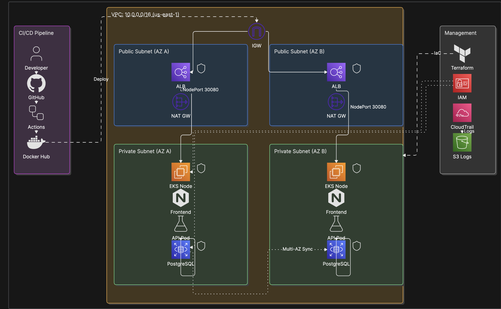

# DevOps Technical Test — Platform & DevOps Engineer

Prueba técnica de arquitectura cloud en AWS con microservicios contenedorizados, orquestados en EKS, desplegados mediante Terraform (IaC) y CI/CD con GitHub Actions.

## URLs

| Recurso | URL |
|---------|-----|
| **Aplicación (ALB)** |http://devops-test-alb-1769044833.us-east-1.elb.amazonaws.com/ |
| **Repositorio** | https://github.com/Maoamadob/DevOpstesting |
| **Docker Hub — API** | https://hub.docker.com/r/maoamadob/devops-api |
| **Docker Hub — Frontend** | https://hub.docker.com/r/maoamadob/devops-frontend |

---

## Arquitectura



> Exporta tu diagrama desde Eraser como PNG y guárdalo en `docs/architecture.png` antes del push a GitHub.

La solución despliega microservicios contenedorizados en **Amazon EKS** dentro de una **VPC** segmentada, expuestos mediante **ALB**, con base de datos **RDS PostgreSQL** en subnet privada, aprovisionamiento **Terraform**, pipeline **GitHub Actions** y capa de **monitoreo Prometheus/Grafana**.

### Flujo de tráfico

```
Internet Users → ALB :80 → EKS NodePort 30080 → frontend (nginx) → api (Flask) :5000 → RDS :5432
```

### Componentes AWS

| Componente | Detalle |
|------------|---------|
| **VPC** | `10.0.0.0/16` — 2 subnets públicas + 2 privadas (us-east-1a/b) |
| **NAT Gateway** | 1 NAT (decisión costo/Free Tier; en prod: 1 por AZ) |
| **ALB** | HTTP:80 → Target Group puerto 30080 |
| **EKS** | `devops-test-eks` — Kubernetes 1.31 |
| **Node Group** | `t3.small` — Free Tier compatible |
| **RDS** | PostgreSQL 15 — `db.t3.micro`, subnet privada |
| **IAM** | Usuario `terraform-admin` para aprovisionamiento |
| **CloudTrail** | Auditoría → bucket S3 |

### Flujo CI/CD

```
Developer → Git Push → GitHub Actions
    → Tests (pytest)
    → Build & Push (Docker linux/amd64 → Docker Hub)
    → Deploy to EKS (kubectl apply + rollout restart)
    → Notify on Failure
```

### Capa de monitoreo (Prometheus + Grafana)

| Componente | Función |
|------------|---------|
| **Prometheus** | Recolección y almacenamiento de métricas |
| **Grafana** | Dashboards y visualización |
| **kube-state-metrics** | Métricas del estado de objetos Kubernetes |
| **node-exporter** | Métricas de CPU, memoria y disco del nodo EC2 |
| **ServiceMonitor** | Scraping de `/metrics` en la API Flask |
| **Metrics Server** | Métricas de recursos para HPA |
| **HPA** | Autoescalado horizontal de pods por CPU |

**Métricas expuestas por la API (Flask + prometheus-client):**

- `http_requests_total` — volumen de requests por endpoint
- `http_request_duration_seconds` — latencia por ruta

**Métricas clave monitoreadas:**

- Disponibilidad: uptime, error rate (5xx), health checks ALB/pods
- Rendimiento: latencia p95, throughput (req/s)
- Infraestructura: CPU/memoria nodos y pods, restarts

```
App /metrics → Prometheus → Grafana dashboards
Kubernetes metrics → Prometheus → Alertas (prod)
HPA ← Metrics Server ← CPU pods
```

---

## Estructura del repositorio

```
.
├── .github/workflows/ci-cd.yml   # Pipeline CI/CD
├── app/
│   ├── api/                      # Microservicio API (Flask + /metrics)
│   └── frontend/                 # Microservicio frontend (nginx)
├── docs/
│   └── architecture.png          # Diagrama de arquitectura (Eraser)
├── k8s/                          # Manifiestos Kubernetes + HPA
├── monitoring/
│   ├── prometheus-values.yaml    # Helm values Prometheus/Grafana
│   └── servicemonitor-api.yaml   # Scraping métricas API
├── terraform/                    # Infraestructura como código
│   ├── vpc.tf
│   ├── eks.tf
│   ├── alb.tf
│   ├── rds.tf
│   ├── security_groups.tf
│   ├── iam.tf
│   ├── variables.tf
│   └── outputs.tf
└── README.md
```

---

## Requisitos previos

- [AWS CLI](https://aws.amazon.com/cli/) configurado (`aws configure`)
- [Terraform](https://www.terraform.io/) >= 1.5
- [kubectl](https://kubernetes.io/docs/tasks/tools/)
- [Docker](https://www.docker.com/)
- Cuenta [Docker Hub](https://hub.docker.com/)
- Cuenta AWS con permisos para EC2, EKS, RDS, VPC, IAM

---

## Despliegue de infraestructura (Terraform)

### 1. Configurar variables

Crear `terraform/terraform.tfvars` (no se sube a Git):

```hcl
aws_region   = "us-east-1"
project_name = "devops-test"
my_ip        = "TU_IP_PUBLICA/32"
db_password  = "PasswordSeguro123!"
```

Obtener tu IP pública:

```bash
curl -4 ifconfig.me
```

### 2. Desplegar

```bash
cd terraform
terraform init
terraform validate
terraform plan
terraform apply
```

El apply tarda ~20–30 minutos (EKS es el componente más lento).

### 3. Conectar kubectl

```bash
aws eks update-kubeconfig --region us-east-1 --name devops-test-eks
kubectl get nodes
```

---

## Despliegue de la aplicación

### Opción A — Manual

```bash
# Build para arquitectura AMD64 (requerido en nodos EKS)
docker build --platform linux/amd64 -t maoamadob/devops-api:latest app/api
docker build --platform linux/amd64 -t maoamadob/devops-frontend:latest app/frontend

docker push maoamadob/devops-api:latest
docker push maoamadob/devops-frontend:latest

kubectl apply -f k8s/
kubectl get pods -n devops-test
```

### Opción B — CI/CD automático

Push a la rama `main` dispara el pipeline en GitHub Actions.

**Secrets requeridos en GitHub** (Settings → Secrets → Actions):

| Secret | Descripción |
|--------|-------------|
| `DOCKER_USERNAME` | Usuario Docker Hub |
| `DOCKER_PASSWORD` | Personal Access Token de Docker Hub |
| `AWS_ACCESS_KEY_ID` | Access Key IAM |
| `AWS_SECRET_ACCESS_KEY` | Secret Key IAM |

---

## Monitoreo (Prometheus + Grafana)

### Encender monitoreo

```bash
# Metrics Server (requerido para HPA)
kubectl apply -f https://github.com/kubernetes-sigs/metrics-server/releases/latest/download/components.yaml
kubectl patch deployment metrics-server -n kube-system --type='json' \
  -p='[{"op": "add", "path": "/spec/template/spec/containers/0/args/-", "value": "--kubelet-insecure-tls"}]'

# Si el nodo está lleno de pods, liberar un slot temporalmente
kubectl scale deployment coredns -n kube-system --replicas=1

# Instalar stack
helm repo add prometheus-community https://prometheus-community.github.io/helm-charts
helm repo update
kubectl create namespace monitoring --dry-run=client -o yaml | kubectl apply -f -
helm install prometheus prometheus-community/kube-prometheus-stack \
  -n monitoring -f monitoring/prometheus-values.yaml

kubectl apply -f monitoring/servicemonitor-api.yaml
kubectl apply -f k8s/hpa-api.yaml
kubectl apply -f k8s/hpa-frontend.yaml
```

### Acceder a Grafana

```bash
kubectl port-forward -n monitoring svc/prometheus-grafana 3000:80
```

- URL: http://localhost:3000
- Usuario: `admin`
- Contraseña: `devops-test`

### Apagar monitoreo (ahorrar recursos)

```bash
helm uninstall prometheus -n monitoring
kubectl delete namespace monitoring
kubectl scale deployment coredns -n kube-system --replicas=2
```

---

## Verificación

```bash
# Nodos EKS
kubectl get nodes

# Pods en ejecución
kubectl get pods -n devops-test

# Servicios
kubectl get svc -n devops-test

# HPA
kubectl get hpa -n devops-test

# Métricas de pods
kubectl top pods -n devops-test

# App en el navegador
open http://devops-test-alb-1797201729.us-east-1.elb.amazonaws.com
```

Respuesta esperada de la API en `/api/info`:

```json
{
  "service": "api",
  "environment": "dev",
  "db_host": "devops-test-postgres.c2zi44qg4uyo.us-east-1.rds.amazonaws.com",
  "message": "DevOps Technical Test - Platform Engineer"
}
```

---

## Mapa de la prueba técnica

| # | Requisito | Implementación |
|---|-----------|----------------|
| 1 | EC2 / servidores AWS | EKS Managed Node Group (`terraform/eks.tf`) |
| 2 | Red — VPC, subnets, ALB | `terraform/vpc.tf`, `terraform/alb.tf`, `terraform/security_groups.tf` |
| 4 | Ciberseguridad — SG, firewall | Security Groups ALB/EKS/RDS |
| 5 | RDS + IAM + auditoría | `terraform/rds.tf`, `terraform/iam.tf` (CloudTrail) |
| 7 | Microservicios Docker + K8s | `app/`, `k8s/` |
| 9 | Infrastructure as Code | `terraform/` |
| 10 | Monitoreo y autoescalado | `monitoring/`, Prometheus/Grafana, HPA, `/metrics` |
| 11 | CI/CD pipeline | `.github/workflows/ci-cd.yml` |
| 12 | Documentación | Este README |
| 13 | App en la nube accesible | ALB URL (ver arriba) |


---

## Decisiones de arquitectura

| Decisión | Justificación |
|----------|---------------|
| **1 NAT Gateway** | Reduce costo en entorno de prueba / Free Tier |
| **t3.small en EKS** | Compatible con Free Tier (t3.medium no lo es) |
| **NodePort 30080 + ALB** | Integración directa ALB → EKS sin Load Balancer Controller |
| **Docker Hub** | Simplicidad; en prod se usaría Amazon ECR |
| **Push-based deploy** | GitHub Actions + kubectl; en prod migrar a ArgoCD (GitOps) |
| **backup_retention_period = 1** | Límite de Free Tier en RDS |
| **Prometheus on-demand** | Stack pesado; se apaga con `helm uninstall` fuera de demos |
| **maxSurge: 0 en Deployments** | Rollout en nodo único sin pods Pending extra |

---

## Destruir la infraestructura

> Ejecutar solo después de entregar la prueba, para evitar costos.

```bash
# 1. Eliminar recursos Kubernetes
kubectl delete namespace devops-test
helm uninstall prometheus -n monitoring 2>/dev/null || true
kubectl delete namespace monitoring 2>/dev/null || true

# 2. Destruir infraestructura AWS
cd terraform
terraform destroy
```

Verificar en consola AWS que no queden: instancias EC2, cluster EKS, RDS, ALB, NAT Gateway, VPC custom.

---

## Costos estimados

| Recurso | Costo aproximado |
|---------|------------------|
| EKS control plane | ~$0.10/hora |
| NAT Gateway | ~$0.045/hora + tráfico |
| ALB | ~$0.0225/hora |
| EC2 t3.small (nodo EKS) | Free Tier / ~$0.02/hora |
| RDS db.t3.micro | Free Tier (12 meses) |

**Recomendación:** ejecutar `terraform destroy` al finalizar la prueba.

---

## Autor

**Mauricio Amado** — Platform & DevOps Engineer Technical Test (2026)
